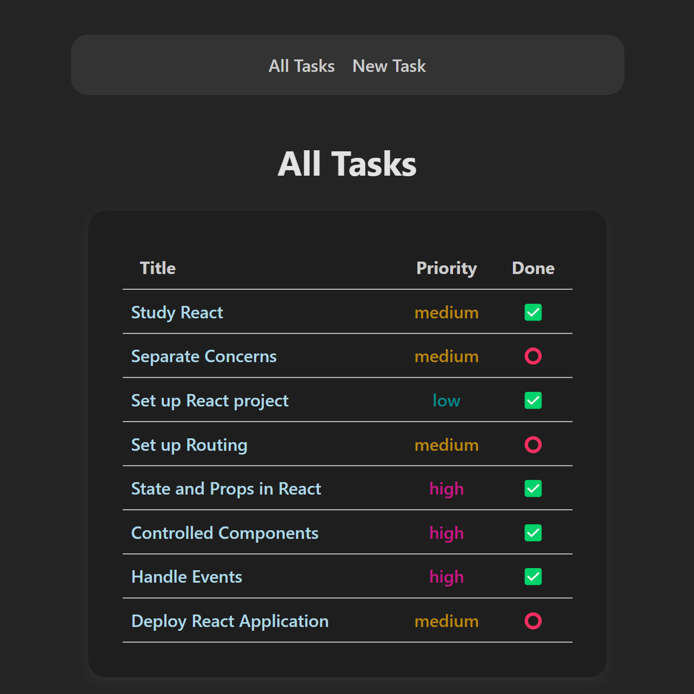
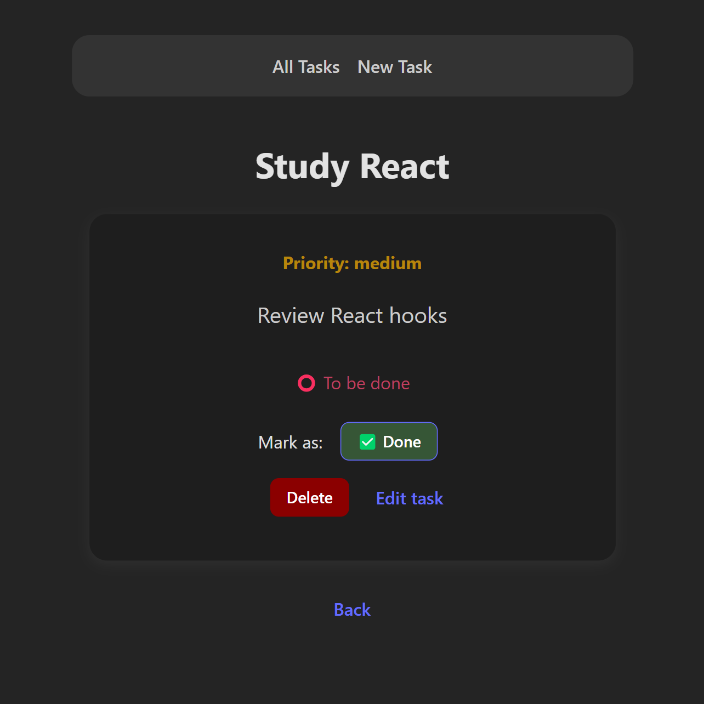
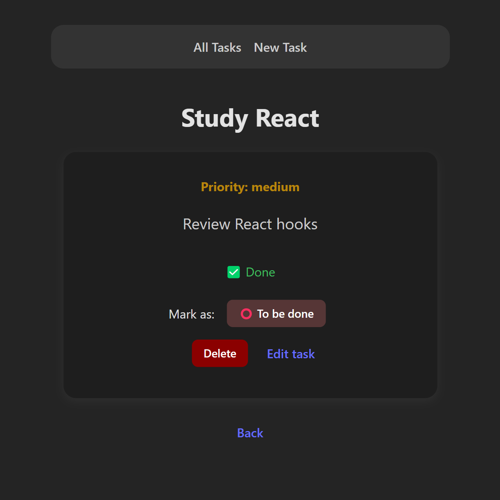
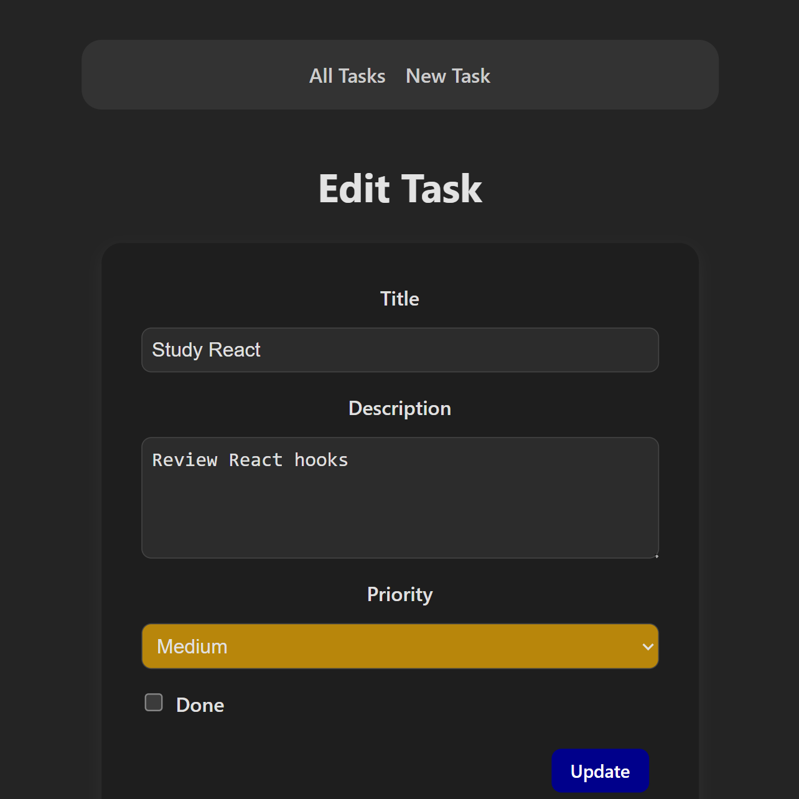
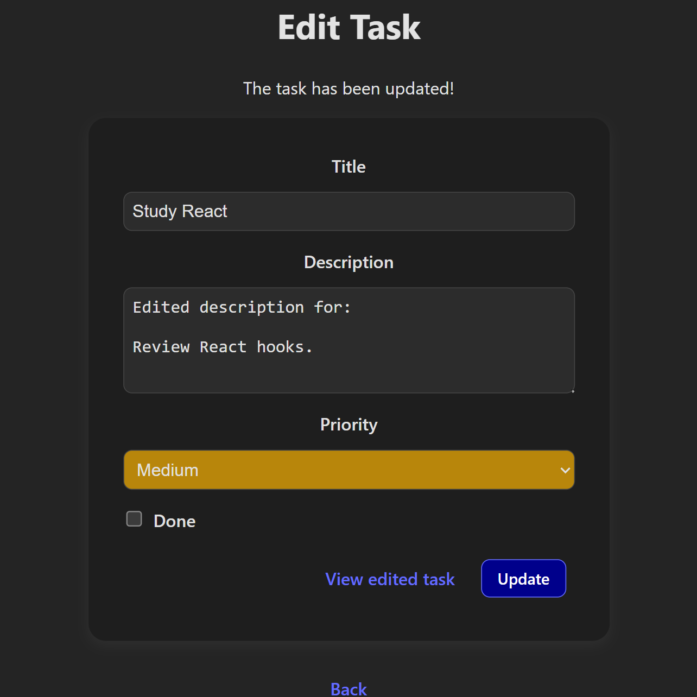
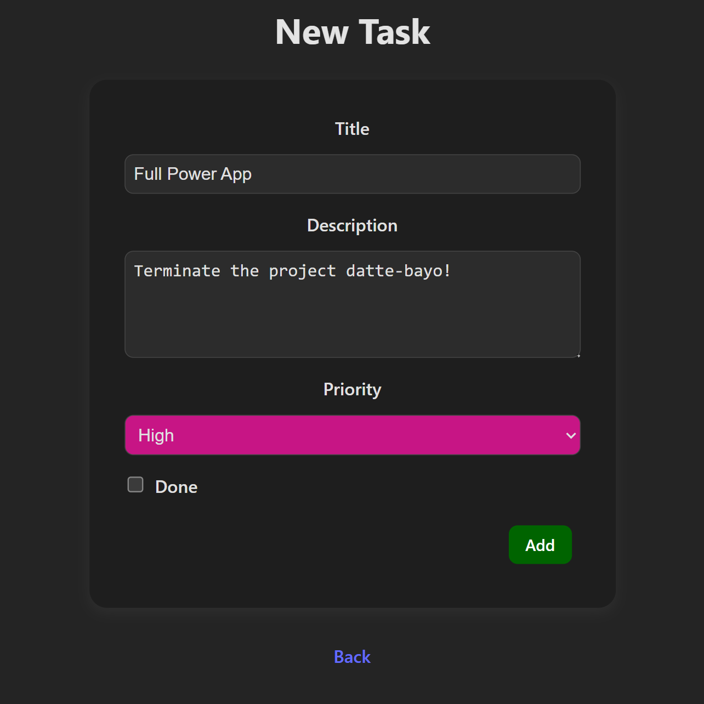
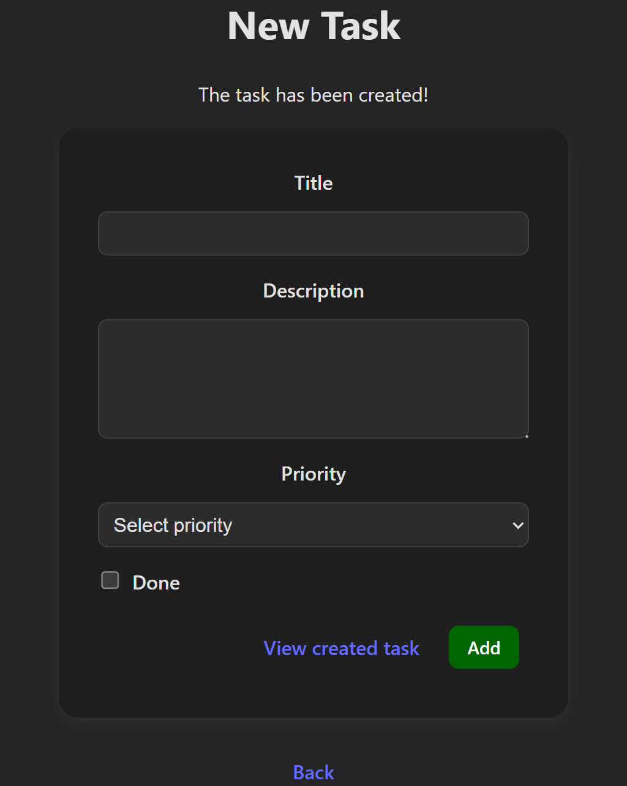

# 📋 Task Manager – React SPA

A single-page app for task management built with React + Vite. It allows users to list, create, edit, delete, and mark tasks as completed. The app communicates with a REST API backend and is built using modern React patterns with reusable components and clean state management.

---

## ✨ Features

- View all tasks in a list view  
- Create new tasks (title required, description and priority optional)  
- Edit existing tasks  
- Mark tasks as completed or uncompleted  
- Delete tasks with confirmation  
- Data persistence through a RESTful API (local or remote)  
- Built with reusable components and clean React architecture

---

## 🗂 Project Structure

```
├── public/               # Static assets (website tab icon file)
├── src/                  # Application source code
│   ├── components/       # Reusable UI components
│   ├── pages/            # Page views for routing
│   ├── App.css           # Styles for the App
│   ├── App.jsx           # Main app component
│   ├── constants.js      # Constants for the app (eg: API_URL)
│   ├── index.css         # Global Styles
│   └── main.jsx          # App entry point
├── index.html            # HTML template
├── package.json          # Project metadata and scripts
├── vite.config.js        # Vite configuration
└── README.md             # Project documentation
```

---

## 🚀 Getting Started

### 1. Clone the Repository

```bash
git clone https://github.com/Dario-97-d/react-fundamentals-test.git
cd react-fundamentals-test
```

### 2. Install Dependencies

```bash
npm install
```

### 3. Start the React App

```bash
npm run dev
```

The app will be running at a `localhost` URL, typically `http://localhost:5173`, unless that port is in use. The terminal output will show the exact address after running `npm run dev`.

### 4. Setting up the local database (json-server)

Since the app requires a local REST API to function during development, json-server is used. Here’s how you can set it up

#### 4.1 Create the db.json File

In a separate folder (e.g., server), create a db.json file. This will act as the database for your json-server.

Here’s a sample db.json file to get you started:

```
{
  "tasks": [
    {
      "id": 1,
      "title": "Study React",
      "description": "Review React hooks",
      "priority": "medium",
      "done": true
    },
    {
      "id": 2,
      "title": "Finish the Project",
      "description": "Finish the final course project",
      "priority": "high",
      "done": false
    }
  ]
}
```

#### 4.2 Start the local API

Once you have the db.json file, open a new terminal window (or VS Code window) and navigate to the folder where the db.json is stored.

Start the json-server by running:

```bash
npx json-server --watch db.json --port 3001
```

The server will now be running at: [http://localhost:3001](http://localhost:3001)

---

## ⚙️ Tech Stack

- [React](https://reactjs.org/) – UI library for building the app
- [Vite](https://vitejs.dev/) – Fast build tool and dev server
- [json-server](https://github.com/typicode/json-server) – Local REST API for development
- [React Router DOM](https://reactrouter.com/en/main) – Client-side routing
- [Axios](https://axios-http.com/) – HTTP client for API requests
- **Pure CSS** – No CSS frameworks used

---

## 📸 Screenshots

### Listing all tasks



### Viewing task and marking it as done



### Task is marked as done ✅



### Editing task



### The task has been edited!

A link to view the task is given beside the submit button.



### Creating task



### The task has been created!



---

## 📬 Contributions

This project is intended for learning purposes. Feel free to fork or adapt it.
