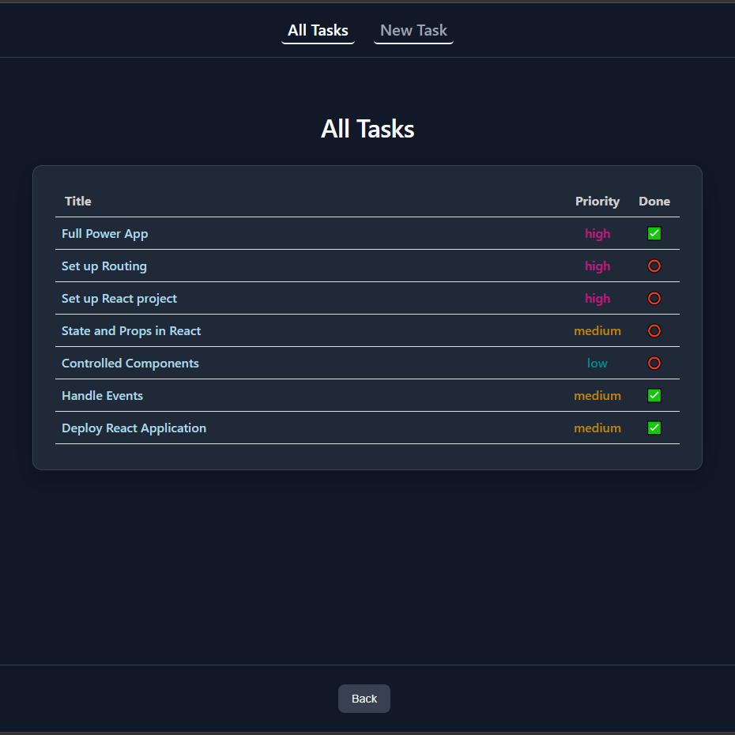
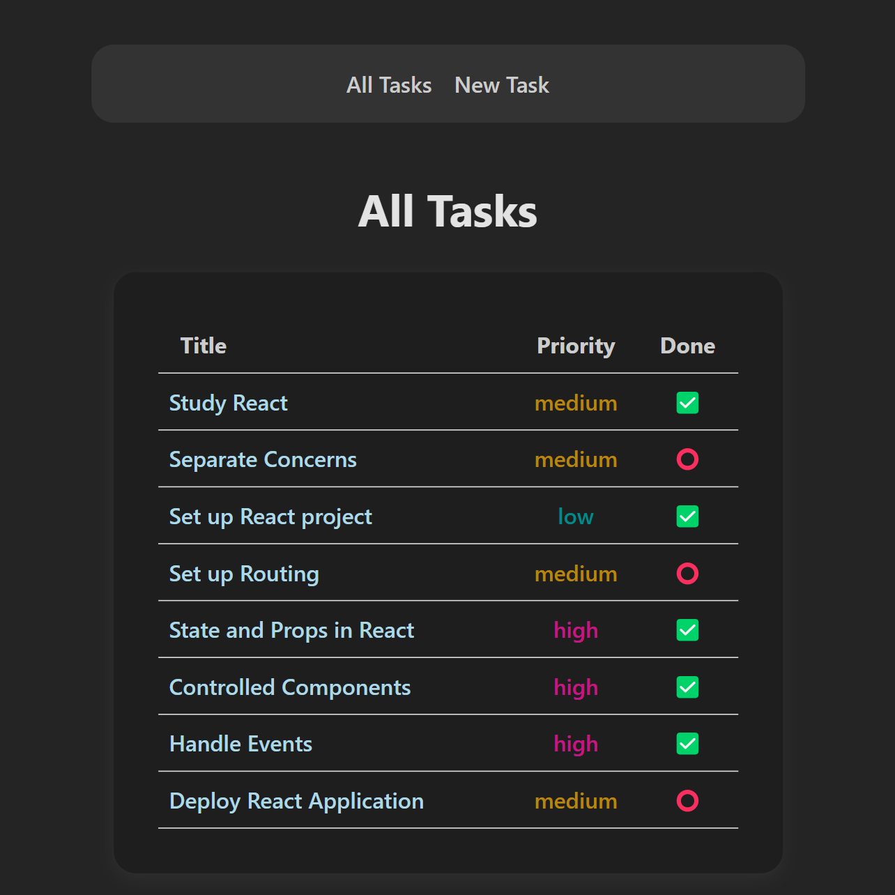
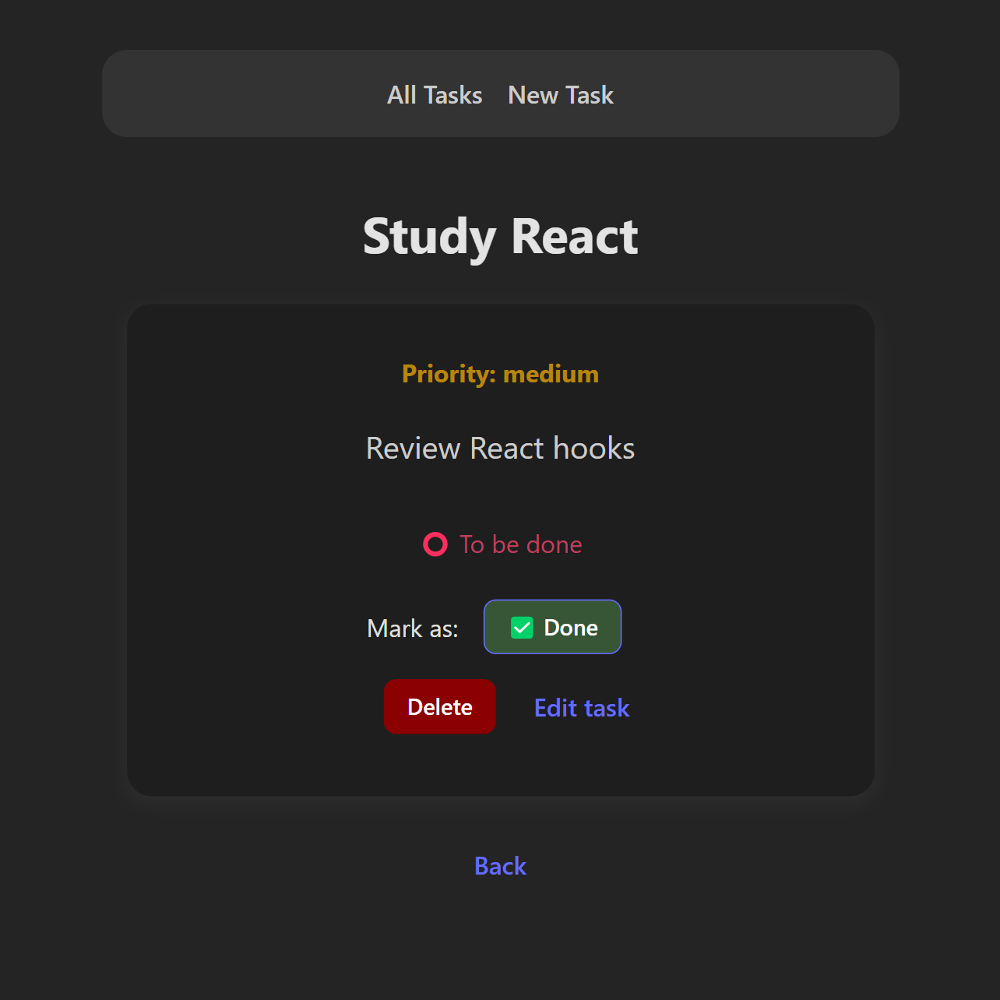
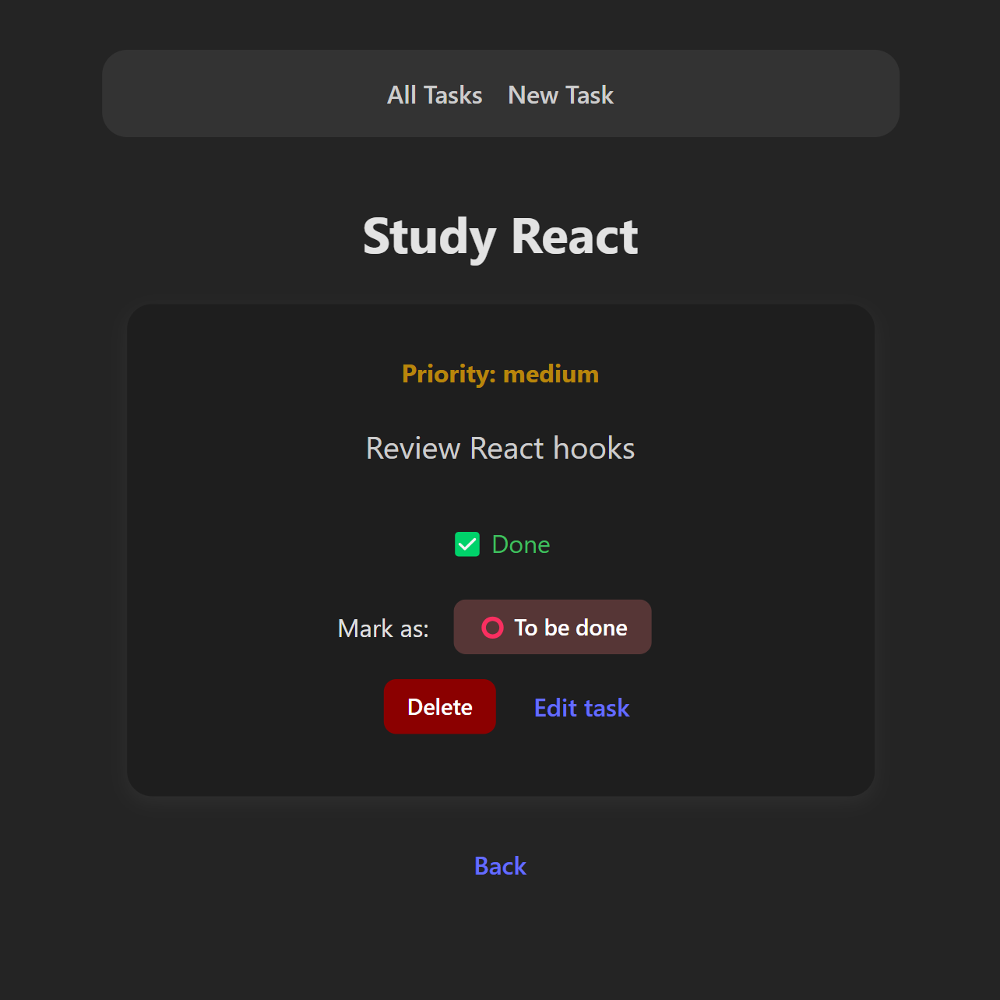
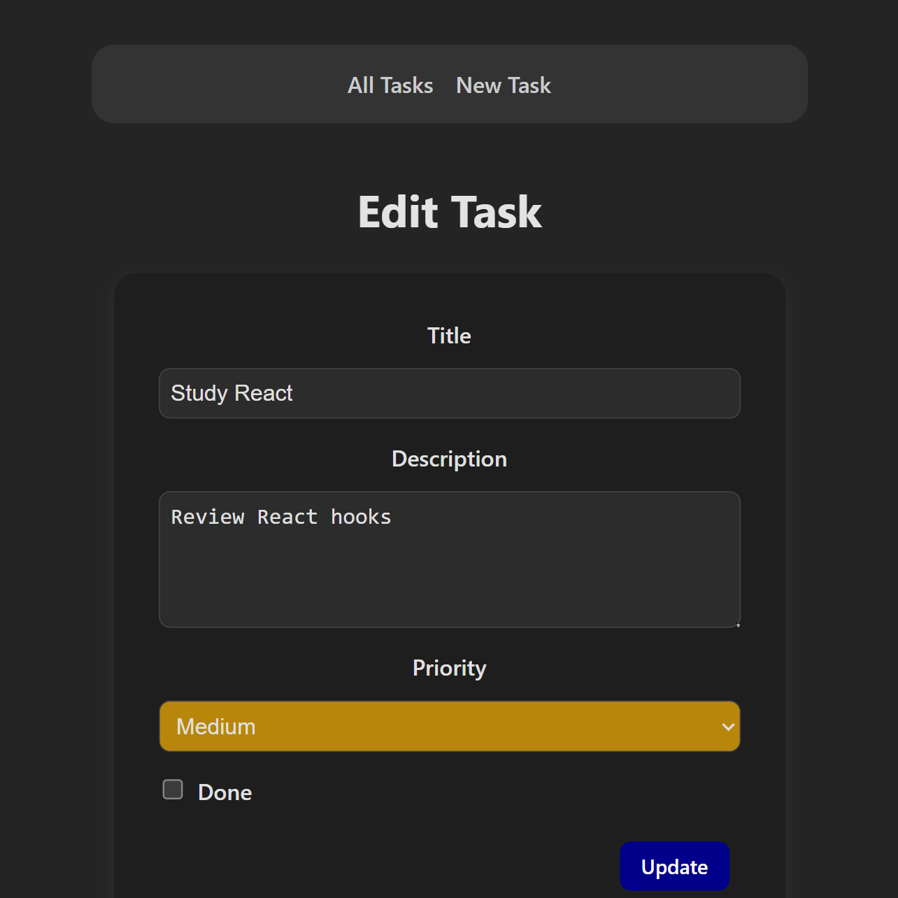
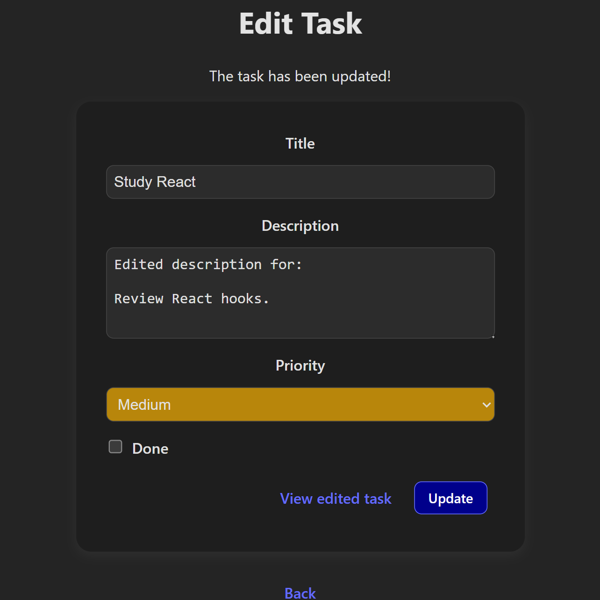
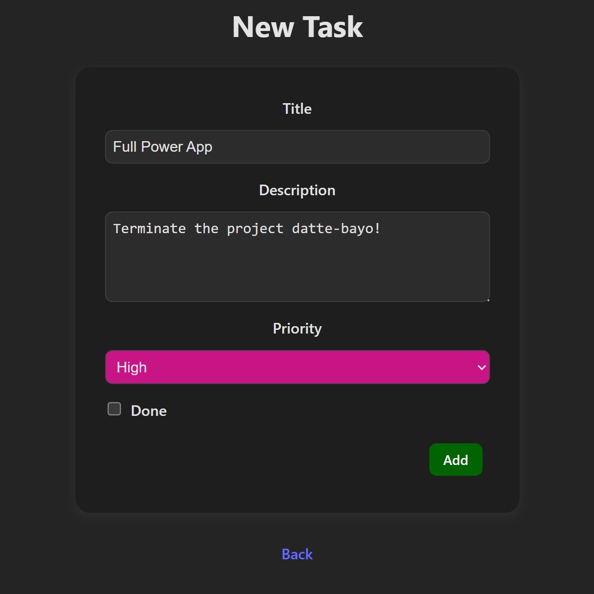
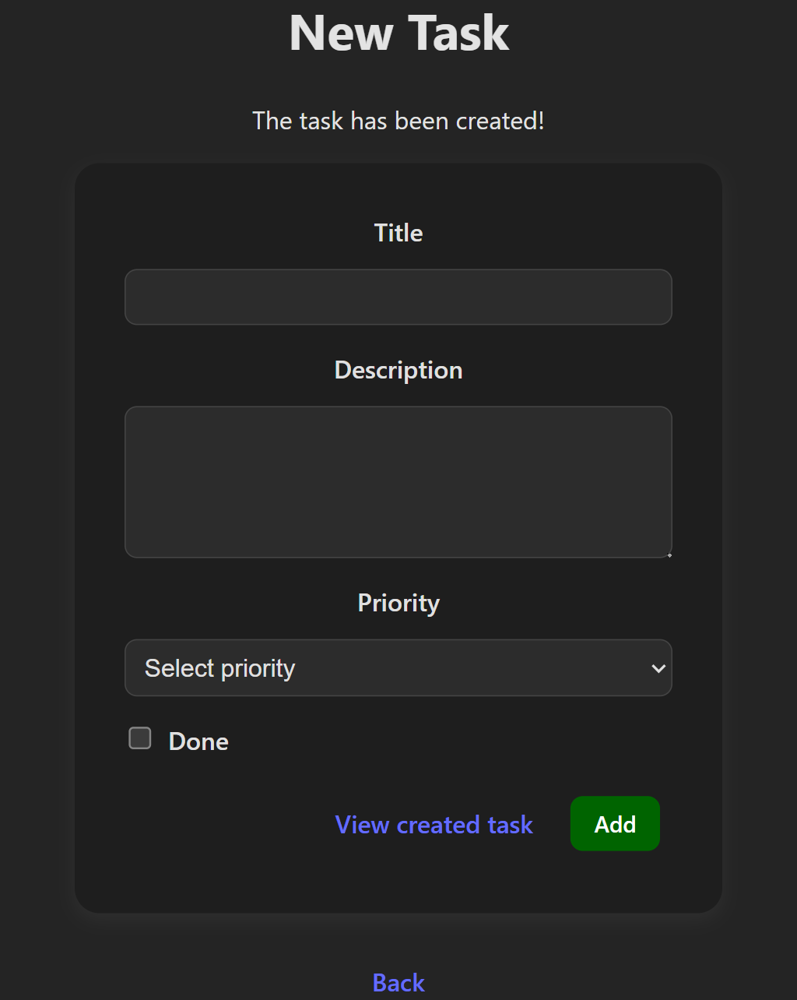

# 📋 Task Manager – React SPA

A single-page app for task management built with React + Vite. It allows users to list, create, edit, delete, and mark tasks as completed. The app communicates with a REST API backend and is built using modern React patterns with reusable components and clean state management.

---

## ✨ Features

- View all tasks in a list view  
- Create new tasks (title required, description and priority optional)  
- Edit existing tasks  
- Mark tasks as completed or uncompleted  
- Delete tasks with confirmation  
- Data persistence through a RESTful API (local or remote)  
- Built with reusable components and clean React architecture

---

## 🗂 Project Structure

```
├── netlify/              # Netlify functions
├── public/               # Static assets (website tab icon file)
├── src/                  # Application source code
│   ├── components/       # Reusable UI components
│   ├── pages/            # Page views for routing
│   ├── utils/            # Utilities (api and constants)
│   ├── App.css           # Styles for the App
│   ├── App.jsx           # Main app component
│   ├── index.css         # Global Styles
│   └── main.jsx          # App entry point
├── index.html            # HTML template
├── package.json          # Project metadata and scripts
├── vite.config.js        # Vite configuration
└── README.md             # Project documentation
```

---

## ⚙️ Tech Stack

- [Vite](https://vitejs.dev/) – Fast build tool and dev server
- [React](https://reactjs.org/) – UI library for building the app
- [React Router DOM](https://reactrouter.com/en/main) – Client-side routing
- [Axios](https://axios-http.com/) – HTTP client for API requests
- [Netlify](https://www.netlify.com/) – Free frontend hosting with functions for secure db access
- **Pure CSS** – No CSS frameworks used

---

## 📸 Screenshots

### New Design



### Listing all tasks



### Viewing task and marking it as done



### Task is marked as done ✅



### Editing task



### The task has been edited!

A link to view the task is given beside the submit button.



### Creating task



### The task has been created!



---

## 📬 Contributions

This project is intended for learning purposes. Feel free to fork or adapt it.
