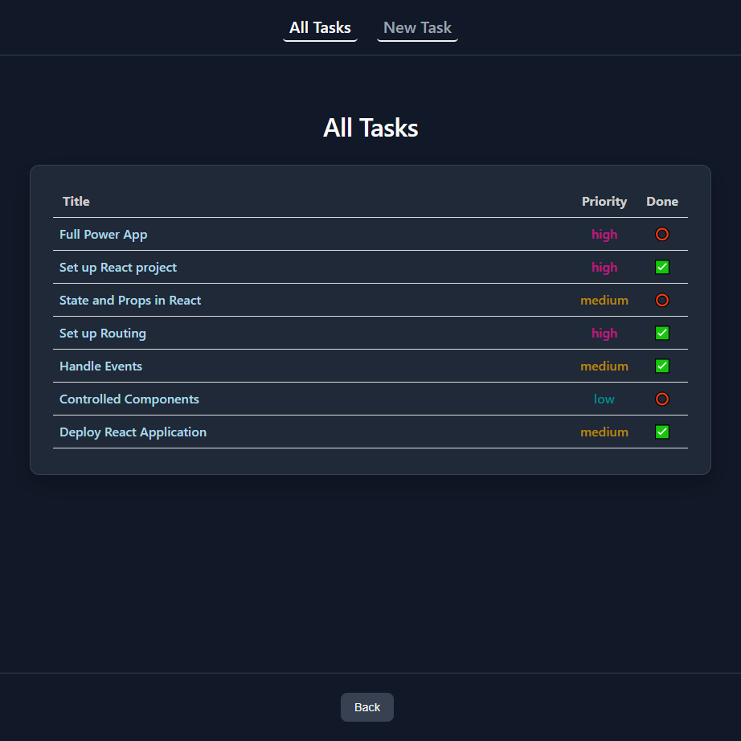
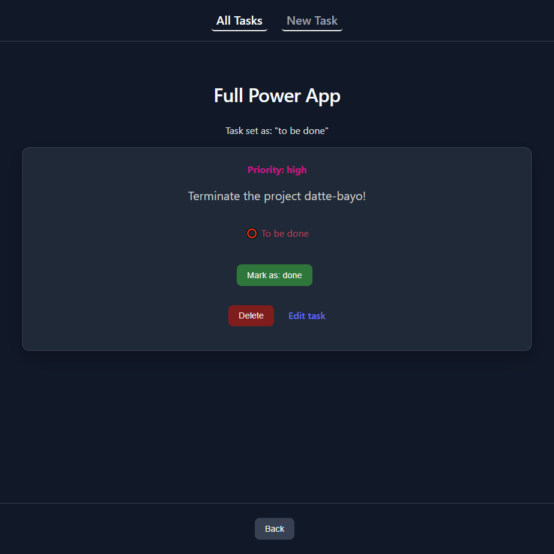
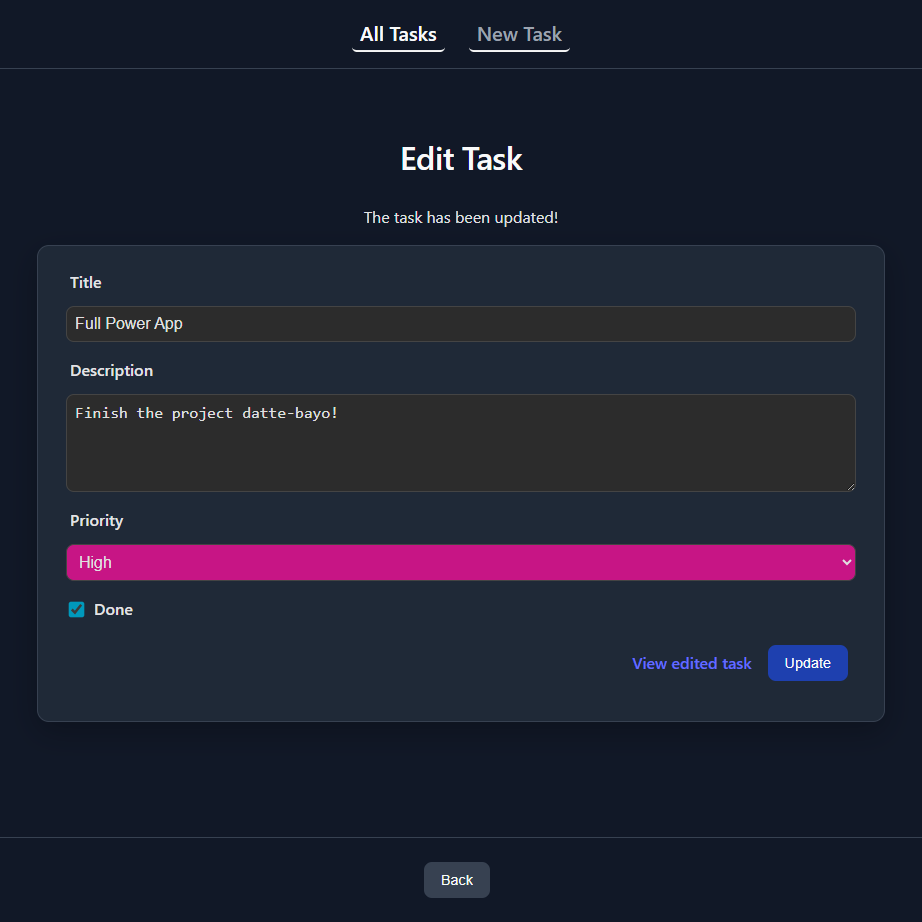
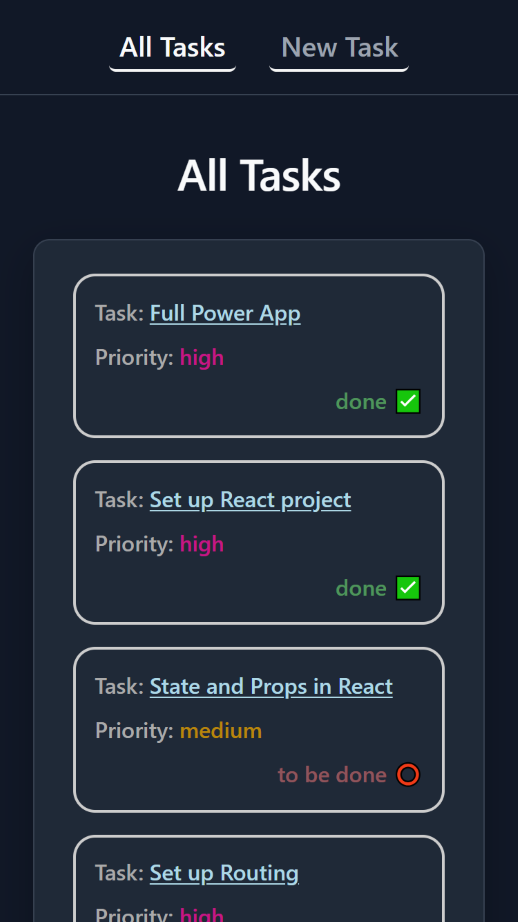

# 📋 Task CRUD – React SPA

A single-page app for task management built with React + Vite. It allows users to list, create, edit, delete, and mark tasks as completed. The app communicates with a REST API backend.

This app was initially made as the final project of a 25-hour React Fundamentals course, using a local json-server instance. After the course ended, I updated it to use Netlify functions to securely access a NoSQL database on restdb.io.

## Live Demo

https://react-test-dario-97-d.netlify.app/

---

## ✨ Features

- List Tasks
- Create and Edit Task
- Mark Task as 'done' or 'to be done'
- Delete Task with confirmation

---

## 💡 Implementation Notes

- Responsive layout (Grid and Flexbox)
- Data persistence (cloud NoSQL database)
- Secure database access, using Netlify functions as a proxy to hide the API key
- User feedback via inline status messages and navigation to updated tasks

---

## ⚙️ Tech Stack

- [Vite](https://vitejs.dev/) – Fast build tool and dev server
- [React](https://reactjs.org/) – UI library for building the app
- [React Router DOM](https://reactrouter.com/en/main) – Client-side routing
- [Axios](https://axios-http.com/) – HTTP client for API requests
- [Netlify](https://www.netlify.com/) – Free frontend hosting with functions for secure db access
- [restdb.io](https://restdb.io/) - NoSQL database host with RESTful API

---

## 🗂 Project Structure

```
├── netlify/
├── public/
├── src/
│   ├── components/
│   ├── pages/
│   ├── utils/
│   │
│   ├── App.css
│   ├── App.jsx
│   ├── index.css
│   └── main.jsx
├── index.html
├── package.json
├── vite.config.js
└── README.md
```

## 📸 Screenshots

### List Tasks



### Task View (just marked as 'to be done')



### Task Updated



### List Tasks Mobile


